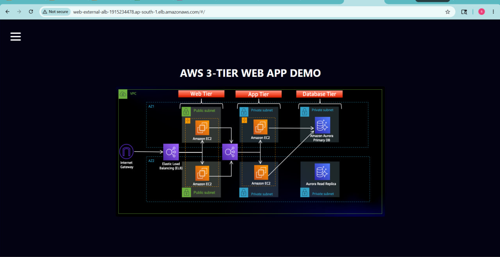
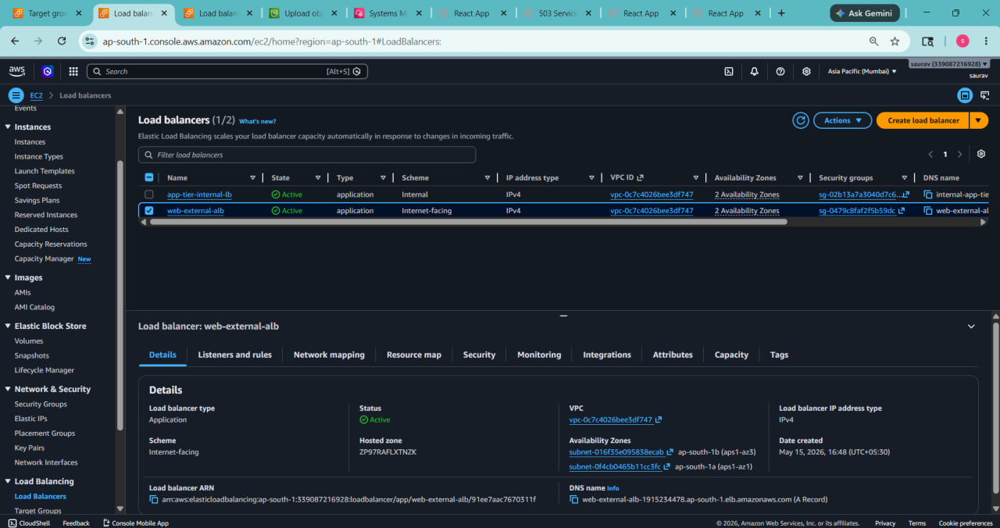
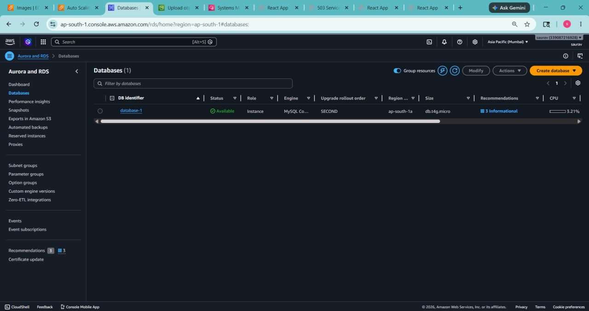
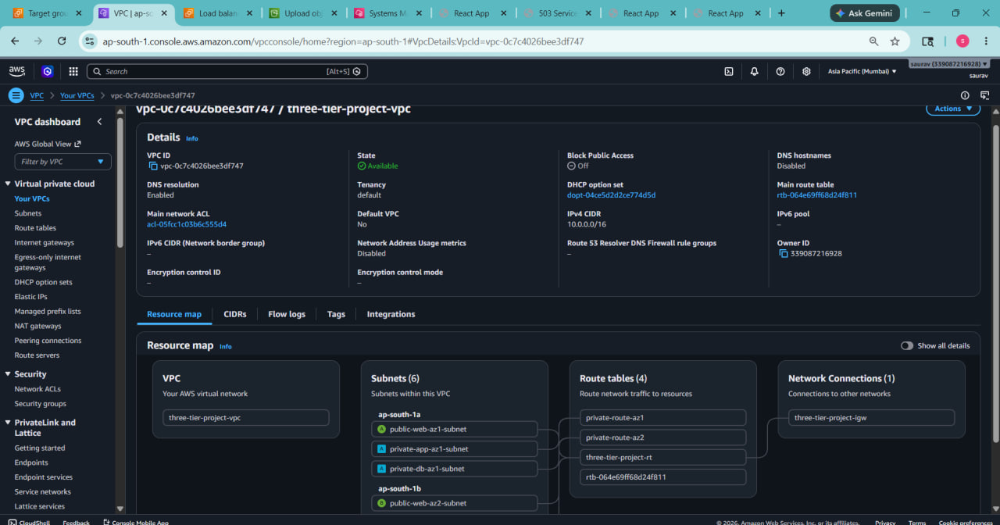
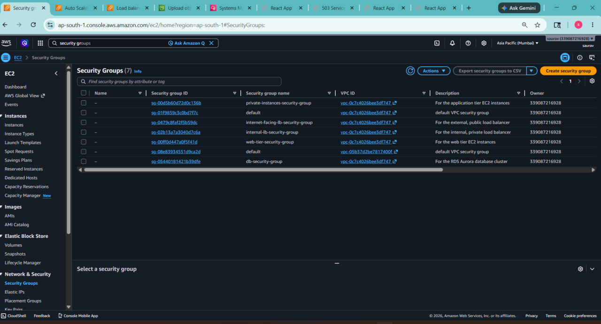
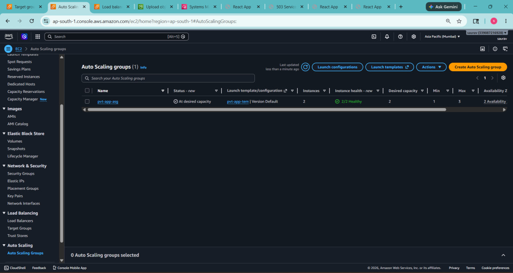
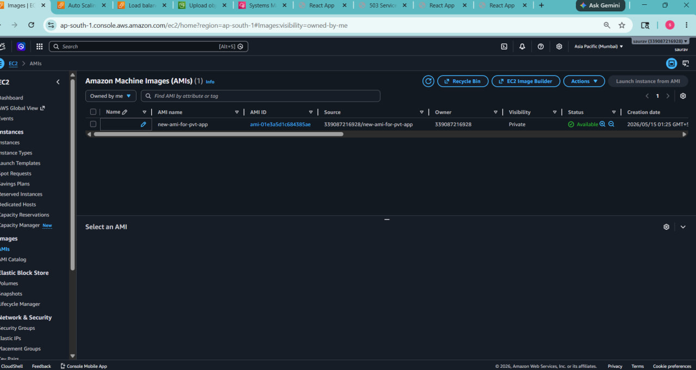
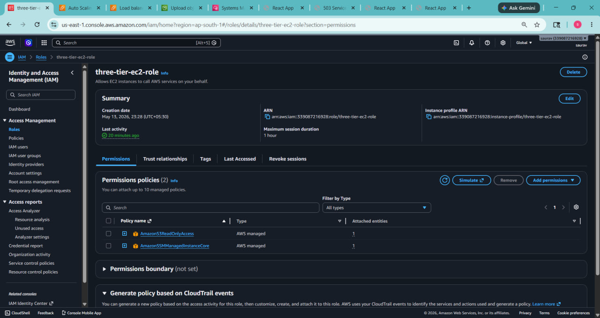

# AWS 3-Tier Architecture Project

# AWS 3-Tier Architecture Project

A production-style AWS 3-tier web application architecture built using AWS core services.

This project demonstrates how to design and deploy a secure, scalable, and highly available application infrastructure using:

- Amazon VPC
- EC2
- Application Load Balancer (ALB)
- Auto Scaling Group (ASG)
- Amazon Aurora MySQL
- NAT Gateway
- Internet Gateway
- IAM Roles
- AWS Systems Manager (SSM)
- Nginx
- React Frontend
- Node.js Backend

This project follows real-world cloud architecture principles with public and private subnet separation, secure internal communication, and high availability across multiple Availability Zones.

## Tech Stack

Frontend:
- React
- Nginx

Backend:
- Node.js
- Express.js
- PM2

Cloud:
- AWS EC2
- AWS VPC
- ALB
- Auto Scaling
- Aurora MySQL
- IAM
- SSM
- NAT Gateway
- Internet Gateway
---

## What I Built

In this project, I created a complete 3-tier application architecture on AWS.

### 1. VPC Setup
I created a custom VPC with CIDR block:

10.0.0.0/16

This VPC acts as the private network where all AWS resources are deployed.

---

### 2. Subnets
Inside the VPC, I created 6 subnets across 2 Availability Zones for high availability.

#### Public Subnets
Used for web tier resources.

- public-web-az1-subnet
- public-web-az2-subnet

#### Private App Subnets
Used for backend application servers.

- private-app-az1-subnet
- private-app-az2-subnet

#### Private Database Subnets
Used for Aurora database.

- private-db-az1-subnet
- private-db-az2-subnet

---

### 3. Internet Gateway
I attached an Internet Gateway to the VPC so public resources can access the internet.

Used by:

- Web EC2
- External Load Balancer

---

### 4. NAT Gateway
I created a NAT Gateway so private application servers can access the internet for updates, package installation, and external communication without becoming publicly accessible.

---

### 5. Route Tables
Configured route tables:

- Public route table → connected to Internet Gateway
- Private app route tables → connected to NAT Gateway
- Database remains private

---

### 6. Security Groups
Created separate security groups for each layer.

#### Web Security Group
Allowed:

- HTTP (80) from external load balancer
- SSH (22) for management

#### App Security Group
Allowed:

- Port 4000 only from internal load balancer

#### Database Security Group
Allowed:

- MySQL/Aurora port only from app tier

---

### 7. Database Layer
Created Amazon Aurora MySQL database cluster.

Database is deployed in private database subnets for security.

---

### 8. Application Tier
Created backend Node.js application servers.

Configured:

- PM2 for process management
- Health check endpoint
- Internal Application Load Balancer
- Target Group on port 4000

This layer handles backend API requests.

---

### 9. Web Tier
Created frontend EC2 server.

Configured:

- Nginx web server
- React frontend build deployment
- External Application Load Balancer
- Web target group on port 80

This layer handles user-facing frontend traffic.

---

### 10. Load Balancers
Created 2 Application Load Balancers.

#### External ALB
Receives public internet traffic and routes requests to web servers.

Flow:

User → External ALB → Web EC2

#### Internal ALB
Used for private communication between web and app tier.

Flow:

Web EC2 → Internal ALB → App EC2

---

### 11. IAM + SSM
Configured IAM role for EC2 instances.

Used Systems Manager Session Manager for secure instance access without SSH keys.

---

## Final Request Flow

User
→ External Load Balancer
→ Web Tier EC2
→ Internal Load Balancer
→ App Tier EC2
→ Aurora Database

---

## What I Learned

From this project I learned:

- VPC networking
- CIDR and subnet planning
- Public vs private subnet design
- Route tables
- Internet Gateway vs NAT Gateway
- Security group design
- Load balancing
- Health checks
- Auto Scaling concepts
- Aurora deployment
- Nginx deployment
- PM2 process management
- SSM troubleshooting
- Real-world AWS architecture design

---

## Architecture Diagram

(Add screenshot here)

---

## Final Result

Successfully deployed a working AWS 3-tier web application architecture.

## Screenshots

### Frontend Running

### Load Balancers

### Aurora Database

### VPC Architecture

### Security Groups

### Auto Scaling Group

### AMI / Launch Template

### IAM Role
